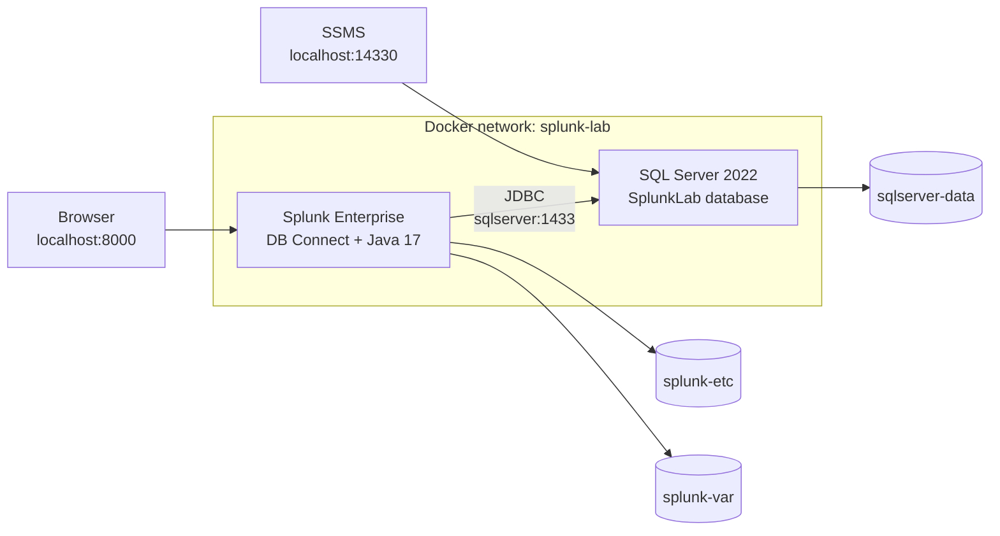

# Splunk Enterprise + DB Connect Docker Lab

A persistent local study environment for learning **Splunk Enterprise**, **Splunk DB Connect**, and **Microsoft SQL Server 2022** with Docker Compose.

The lab runs Splunk and SQL Server in separate containers, connects them through a private Docker network, and preserves configuration, indexed data, DB Connect checkpoints, installed apps, and SQL Server databases in named Docker volumes.

> [!WARNING]
> This project is intended for **local study only**. Do not expose its services to the public internet or reuse the example credentials in a real environment.

## Contents

- [Architecture](#architecture)
- [Features](#features)
- [Project structure](#project-structure)
- [Prerequisites](#prerequisites)
- [Configuration](#configuration)
- [First-time setup](#first-time-setup)
- [Initialize the SQL Server lab database](#initialize-the-sql-server-lab-database)
- [Daily start and stop](#daily-start-and-stop)
- [Accessing the services](#accessing-the-services)
- [Splunk DB Connect configuration](#splunk-db-connect-configuration)
- [Creating the Splunk index](#creating-the-splunk-index)
- [Creating the database input](#creating-the-database-input)
- [Verification searches](#verification-searches)
- [Useful Docker commands](#useful-docker-commands)
- [Data persistence](#data-persistence)
- [Backup and restore](#backup-and-restore)
- [Troubleshooting](#troubleshooting)
- [Splunk licensing](#splunk-licensing)
- [Security notes](#security-notes)

## Architecture



### Main endpoints

| Service | Address | Purpose |
|---|---|---|
| Splunk Web | `http://localhost:8000` | Splunk administration and search |
| Splunk management port | `localhost:8089` | Splunk management API |
| HTTP Event Collector | `localhost:8088` | HEC ingestion |
| Splunk receiving port | `localhost:9997` | Forwarder ingestion |
| SQL Server from Windows/SSMS | `localhost,14330` | Host-to-container SQL connection |
| SQL Server from DB Connect | `sqlserver:1433` | Container-to-container JDBC connection |

The SQL Server addresses differ because SSMS uses the port published on the Windows host, while Splunk communicates directly with SQL Server through the Docker network.

## Features

- Splunk Enterprise running in Docker.
- Java 17 runtime included for Splunk DB Connect.
- Microsoft SQL Server 2022 Developer Edition.
- Persistent Docker volumes for Splunk and SQL Server.
- Read-only SQL identity for DB Connect.
- Rising-column database input.
- Sample Splunk searches for validating ingested application events.
- Health checks for both containers.
- Local sample-data directory mounted read-only into Splunk.

## Project structure

```text
Splunk/
├── .env
├── .gitignore
├── Dockerfile
├── compose.yaml
├── README.md
├── sample-data/
└── sql/
    └── init.sql
```

Recommended `.gitignore`:

```gitignore
# Local secrets
.env

# IDE and OS files
.vscode/
.idea/
.DS_Store
Thumbs.db

# Local logs and temporary files
*.log
*.tmp
```

## Prerequisites

Install the following before starting:

- Docker Desktop with WSL 2 integration enabled.
- A WSL Linux distribution.
- Git.
- A modern web browser.
- SQL Server Management Studio, Azure Data Studio, or another SQL client.

Verify Docker from WSL:

```bash
docker --version
docker compose version
```

## Configuration

### Dockerfile

The Splunk image is extended with a Java 17 runtime copied from Eclipse Temurin. This avoids installing Java with a package manager inside the Splunk image.

```dockerfile
FROM eclipse-temurin:17-jre AS java-runtime

FROM splunk/splunk:latest

USER root

COPY --from=java-runtime /opt/java/openjdk /opt/java/openjdk

ENV JAVA_HOME=/opt/java/openjdk
ENV PATH="${JAVA_HOME}/bin:${PATH}"

USER ansible
```

### `compose.yaml`

```yaml
services:
  splunk:
    build:
      context: .
      dockerfile: Dockerfile
    image: alessio-splunk-dbconnect:latest
    container_name: splunk
    hostname: splunk
    restart: unless-stopped
    environment:
      SPLUNK_START_ARGS: --accept-license
      SPLUNK_GENERAL_TERMS: --accept-sgt-current-at-splunk-com
      SPLUNK_PASSWORD: ${SPLUNK_PASSWORD}
      SPLUNK_ROLE: splunk_standalone
      JAVA_HOME: /opt/java/openjdk
    ports:
      - "8000:8000"
      - "8089:8089"
      - "8088:8088"
      - "9997:9997"
    volumes:
      - splunk-etc:/opt/splunk/etc
      - splunk-var:/opt/splunk/var
      - ./sample-data:/data/sample-data:ro
    networks:
      - splunk-lab
    depends_on:
      sqlserver:
        condition: service_healthy
    healthcheck:
      test:
        - CMD-SHELL
        - /opt/splunk/bin/splunk status >/dev/null 2>&1 || exit 1
      interval: 30s
      timeout: 10s
      retries: 20
      start_period: 180s

  sqlserver:
    image: mcr.microsoft.com/mssql/server:2022-latest
    container_name: sqlserver
    hostname: sqlserver
    restart: unless-stopped
    environment:
      ACCEPT_EULA: "Y"
      MSSQL_PID: "Developer"
      MSSQL_SA_PASSWORD: ${MSSQL_SA_PASSWORD}
    ports:
      - "14330:1433"
    volumes:
      - sqlserver-data:/var/opt/mssql
      - ./sql:/scripts:ro
    networks:
      - splunk-lab
    healthcheck:
      test:
        - CMD-SHELL
        - >-
          /opt/mssql-tools18/bin/sqlcmd
          -S localhost
          -U sa
          -P "$$MSSQL_SA_PASSWORD"
          -C
          -Q "SELECT 1"
          >/dev/null 2>&1 || exit 1
      interval: 10s
      timeout: 10s
      retries: 30
      start_period: 60s

networks:
  splunk-lab:
    name: splunk-lab

volumes:
  splunk-etc:
    name: splunk-etc
  splunk-var:
    name: splunk-var
  sqlserver-data:
    name: sqlserver-data
```

Port `14330` is used on the host because the standard SQL Server port, `1433`, may already be occupied by another local SQL Server instance.

### `.env`

Create a local `.env` file in the project root:

```dotenv
SPLUNK_PASSWORD=replace-with-a-strong-password
MSSQL_SA_PASSWORD=replace-with-a-strong-sa-password
```

The `.env` file must not be committed to Git.

A safe repository template can be stored as `.env.example`:

```dotenv
SPLUNK_PASSWORD=
MSSQL_SA_PASSWORD=
```

## First-time setup

Run all commands from WSL:

```bash
cd /mnt/c/Users/tugno/Code/Splunk
```

Validate the Compose configuration:

```bash
docker compose config
```

Build the custom Splunk image:

```bash
docker compose build --no-cache splunk
```

Start the environment:

```bash
docker compose up -d
```

Check container status:

```bash
docker compose ps
```

Both services should eventually report a healthy status. Splunk can take several minutes during its first startup.

Follow startup logs when needed:

```bash
docker compose logs -f
```

## Initialize the SQL Server lab database

The SQL Server container starts the database engine, but it does **not** automatically execute `sql/init.sql`.

The Compose file mounts the local `./sql` directory inside the SQL Server container at:

```text
/scripts
```

Therefore, the SQL initialization script is available inside the container as:

```text
/scripts/init.sql
```

> [!IMPORTANT]
> Run this step after the SQL Server container reports `healthy`. This creates the `SplunkLab` database, sample tables and views, sample rows, and the read-only `splunk_reader` account used by DB Connect.

First verify that the script exists on the host:

```bash
ls -la sql
```

You should see:

```text
init.sql
```

Then verify that Docker mounted it inside the container:

```bash
docker compose exec sqlserver ls -la /scripts
```

Run the initialization script:

```bash
docker compose exec sqlserver \
  /opt/mssql-tools18/bin/sqlcmd \
  -S localhost \
  -U sa \
  -P "$MSSQL_SA_PASSWORD" \
  -C \
  -i /scripts/init.sql
```

If the shell variable is not loaded, use the password stored in `.env` directly:

```bash
docker compose exec sqlserver \
  /opt/mssql-tools18/bin/sqlcmd \
  -S localhost \
  -U sa \
  -P 'SqlLab1234!Secure' \
  -C \
  -i /scripts/init.sql
```

Do **not** use:

```text
/sql/init.sql
```

That path does not exist in the container with the current Compose configuration. The correct path is:

```text
/scripts/init.sql
```

Verify that the database was created:

```bash
docker compose exec sqlserver \
  /opt/mssql-tools18/bin/sqlcmd \
  -S localhost \
  -U sa \
  -P "$MSSQL_SA_PASSWORD" \
  -C \
  -Q "SELECT name FROM sys.databases WHERE name = 'SplunkLab';"
```

Verify the sample data:

```bash
docker compose exec sqlserver \
  /opt/mssql-tools18/bin/sqlcmd \
  -S localhost \
  -U sa \
  -P "$MSSQL_SA_PASSWORD" \
  -C \
  -d SplunkLab \
  -Q "SELECT COUNT(*) AS ApplicationEventCount FROM dbo.ApplicationEvents;"
```

Verify the read-only DB Connect account:

```bash
docker compose exec sqlserver \
  /opt/mssql-tools18/bin/sqlcmd \
  -S localhost \
  -U splunk_reader \
  -P 'SplunkReader1234!' \
  -C \
  -d SplunkLab \
  -Q "SELECT COUNT(*) AS ApplicationEventCount FROM dbo.ApplicationEvents;"
```

### When must this script be run again?

You normally run `init.sql` only:

- after the first creation of the SQL Server volume;
- after `docker compose down --volumes`;
- after deleting the `sqlserver-data` volume;
- after intentionally resetting the SQL Server lab.

You do **not** need to run it after a normal:

```bash
docker compose stop
docker compose start
```

The `sqlserver-data` named volume preserves the database.

## Daily start and stop

### Stop the lab and preserve everything

```bash
cd /mnt/c/Users/tugno/Code/Splunk
docker compose stop
```

This preserves:

- Splunk apps and configuration.
- Indexed events.
- DB Connect connections and inputs.
- Rising-column checkpoints.
- SQL Server databases and tables.
- Docker containers and named volumes.

### Start the existing lab again

```bash
cd /mnt/c/Users/tugno/Code/Splunk
docker compose start
docker compose ps
```

Wait for SQL Server and Splunk to become healthy, then open `http://localhost:8000`.

### Remove containers but keep the data

```bash
docker compose down
```

This removes the containers and Docker network but keeps the named volumes. Recreate the containers with:

```bash
docker compose up -d
```

### Commands that delete lab data

> [!CAUTION]
> Do not run these commands during normal study sessions unless you intentionally want to reset the environment.

```bash
docker compose down --volumes
docker volume rm splunk-etc splunk-var sqlserver-data
docker system prune --volumes
```

These commands can permanently remove Splunk settings, indexed events, DB Connect configuration, checkpoints, and SQL Server databases.

## Accessing the services

### Splunk Web

Open:

```text
http://localhost:8000
```

Log in with:

- Username: `admin`
- Password: the value of `SPLUNK_PASSWORD` in `.env`

### SQL Server from SSMS

Use the following connection settings:

| Setting | Value |
|---|---|
| Server | `localhost,14330` |
| Authentication | SQL Server Authentication |
| User | `sa` |
| Password | Value of `MSSQL_SA_PASSWORD` in `.env` |
| Encrypt | Optional for this local lab |
| Trust server certificate | Enabled |

Depending on the client, `127.0.0.1\sqlserver,14330` can also be used.

### SQL Server from Splunk DB Connect

| Setting | Value |
|---|---|
| Host | `sqlserver` |
| Port | `1433` |
| Database | `SplunkLab` |
| Database user | `splunk_reader` |

## Splunk DB Connect configuration

Install Splunk DB Connect through **Apps → Find More Apps** or install the package manually.

### Java configuration

In DB Connect, configure:

| Setting | Value |
|---|---|
| JRE installation path | `/opt/java/openjdk` |
| Task Server port | `9998` |
| Query Server port | `9999` |

Verify Java from the host:

```bash
docker compose exec splunk java -version
```

You should see Java 17.

### Database identity

Create a DB Connect identity with:

| Setting | Value |
|---|---|
| Identity name | `sqlserver_reader` |
| Username | `splunk_reader` |
| Password | Password assigned in `sql/init.sql` |

### Database connection

Create a connection with:

| Setting | Value |
|---|---|
| Connection name | `sqlserver_lab` |
| Database type | Microsoft SQL Server |
| Host | `sqlserver` |
| Port | `1433` |
| Database | `SplunkLab` |
| Identity | `sqlserver_reader` |

Use **Validate** before saving the connection.

## Creating the Splunk index

Create the target index before running the database input:

1. Open **Settings → Indexes**.
2. Select **New Index**.
3. Enter `sql_lab` as the index name.
4. Save the index.

This order is important. Splunk drops incoming events sent to a missing, disabled, or deleted index.

## Creating the database input

Create the input in Splunk DB Connect with these settings:

| Setting | Value |
|---|---|
| Input name | `application_events` |
| Connection | `sqlserver_lab` |
| Input type | Rising |
| Rising column | `EventID` |
| Timestamp column | `EventTime` |
| Execution frequency | Every 60 seconds |
| Index | `sql_lab` |
| Source | `dbconnect:application_events` |
| Sourcetype | `sql:application_events` |

Use this query:

```sql
SELECT
    EventID,
    EventTime,
    Application,
    Environment,
    HostName,
    LogLevel,
    UserName,
    ActionName,
    StatusCode,
    ResponseTimeMs,
    SourceIP,
    Message
FROM "SplunkLab"."dbo"."vw_ApplicationEventsForSplunk"
WHERE EventID > ?
ORDER BY EventID;
```

The `?` placeholder is managed by DB Connect and receives the latest rising-column checkpoint.

### Important rising-input behavior

A rising input can advance its checkpoint after reading rows even when Splunk later drops those events. For example, this can happen when the target index does not exist:

```text
Received event for unconfigured/disabled/deleted index=sql_lab
Dropping them
```

Use this setup order:

1. Create the Splunk index.
2. Create and validate the database connection.
3. Create the DB input.
4. Run the input.
5. Search the target index.

When rows were read but dropped, insert a new SQL row for testing or reset/recreate the input checkpoint to retrieve earlier rows again.

## Verification searches

Confirm that events are being indexed:

```spl
index=sql_lab
```

Count events by application and log level:

```spl
index=sql_lab
| stats count by Application LogLevel
```

Calculate average response time by application:

```spl
index=sql_lab
| stats avg(ResponseTimeMs) AS avg_response_ms by Application
```

Display error events:

```spl
index=sql_lab LogLevel=ERROR
| table _time EventID Application HostName UserName StatusCode Message
```

Check the most recent ingested event:

```spl
index=sql_lab
| sort - EventID
| head 1
| table _time EventID Application Environment HostName LogLevel Message
```

Monitor event volume over time:

```spl
index=sql_lab
| timechart span=5m count by LogLevel
```

## Useful Docker commands

| Purpose | Command |
|---|---|
| Show container status | `docker compose ps` |
| Follow all logs | `docker compose logs -f` |
| Follow Splunk logs | `docker compose logs -f splunk` |
| Follow SQL Server logs | `docker compose logs -f sqlserver` |
| Restart only Splunk | `docker compose restart splunk` |
| Restart only SQL Server | `docker compose restart sqlserver` |
| Verify Java | `docker compose exec splunk java -version` |
| Verify Splunk status | `docker compose exec splunk /opt/splunk/bin/splunk status` |
| Open a shell in Splunk | `docker compose exec splunk bash` |
| Open a shell in SQL Server | `docker compose exec sqlserver bash` |
| Show named volumes | `docker volume ls` |
| Show Compose configuration | `docker compose config` |

## Data persistence

The environment uses three named volumes:

| Volume | Content |
|---|---|
| `splunk-etc` | Splunk apps, configuration, users, DB Connect settings |
| `splunk-var` | Indexed events, internal logs, runtime state, checkpoints |
| `sqlserver-data` | SQL Server system and user databases |

Named volumes survive:

- `docker compose stop` and `start`.
- `docker compose down` and `up -d`.
- Container recreation.
- Splunk image rebuilds.

They do not survive explicit volume deletion.

## Backup and restore

Stop the lab before backing up the volumes:

```bash
docker compose stop
```

Create a backup directory:

```bash
mkdir -p backups
```

Back up the volumes:

```bash
docker run --rm \
  -v splunk-etc:/volume \
  -v "$PWD/backups":/backup \
  alpine \
  tar czf /backup/splunk-etc.tar.gz -C /volume .

docker run --rm \
  -v splunk-var:/volume \
  -v "$PWD/backups":/backup \
  alpine \
  tar czf /backup/splunk-var.tar.gz -C /volume .

docker run --rm \
  -v sqlserver-data:/volume \
  -v "$PWD/backups":/backup \
  alpine \
  tar czf /backup/sqlserver-data.tar.gz -C /volume .
```

Start the lab again:

```bash
docker compose start
```

> [!NOTE]
> For important SQL Server databases, native SQL Server `.bak` backups are preferable to relying only on a Docker volume archive.

## Troubleshooting

### `sqlcmd` reports `Invalid filename`

If this command fails:

```bash
-i /sql/init.sql
```

the path is wrong for this project.

The Compose mount is:

```yaml
- ./sql:/scripts:ro
```

So use:

```bash
-i /scripts/init.sql
```

Confirm the mount with:

```bash
docker compose exec sqlserver ls -la /scripts
```

### Containers do not become healthy

Check status and logs:

```bash
docker compose ps
docker compose logs --tail=200 splunk
docker compose logs --tail=200 sqlserver
```

Common causes include:

- Weak or invalid SQL Server password.
- Port conflict on `8000`, `8088`, `8089`, `9997`, or `14330`.
- Docker Desktop not running.
- WSL integration disabled.
- Insufficient memory assigned to Docker.

### Verify the Docker network

```bash
docker network inspect splunk-lab
```

Both `splunk` and `sqlserver` should be attached.

### Test SQL Server name resolution from Splunk

```bash
docker compose exec splunk getent hosts sqlserver
```

### Test the SQL Server port from Splunk

```bash
docker compose exec splunk bash -lc 'timeout 5 bash -c "</dev/tcp/sqlserver/1433" && echo reachable'
```

### Verify Java inside Splunk

```bash
docker compose exec splunk sh -c '
  echo "JAVA_HOME=$JAVA_HOME"
  /opt/java/openjdk/bin/java -version
'
```

Expected `JAVA_HOME`:

```text
/opt/java/openjdk
```

### DB Connect returns no data

Check the following in order:

1. The `sql_lab` index exists and is enabled.
2. The DB Connect connection validates successfully.
3. The SQL view contains rows.
4. The `splunk_reader` user has `SELECT` permission.
5. The rising column contains values above the saved checkpoint.
6. The input is enabled and scheduled.
7. DB Connect logs do not show JDBC or task-server errors.

Useful Splunk internal search:

```spl
index=_internal (sourcetype=dbx* OR source=*dbconnect*)
| sort - _time
```

### Events were dropped because the index was missing

Create `sql_lab`, then either:

- Insert a new row into the source table, or
- Reset/recreate the rising input checkpoint.

Do not simply rerun the input and expect rows below the checkpoint to be read again.

### Host port `14330` is already in use

Find the process using the port from Windows PowerShell:

```powershell
Get-NetTCPConnection -LocalPort 14330 -ErrorAction SilentlyContinue
```

Change the host-side mapping in `compose.yaml` if necessary:

```yaml
ports:
  - "14331:1433"
```

The DB Connect host and port remain `sqlserver:1433` because container-to-container communication is unchanged.

## Splunk licensing

A new Splunk Enterprise installation normally begins with a time-limited Enterprise Trial. Trial duration, ingestion allowances, and Free-license capabilities can change, so verify the terms shown by the exact Splunk version installed in this lab.

Stopping Docker does not normally pause a time-based trial because the trial is based on calendar time rather than container uptime.

Check the license in Splunk Web:

```text
Settings → Licensing
```

CLI check:

```bash
docker compose exec splunk \
  /opt/splunk/bin/splunk show licenser-localslave \
  -auth "admin:${SPLUNK_PASSWORD}"
```

Because `${SPLUNK_PASSWORD}` is expanded by the shell, run this command from an environment where the variable has been loaded, or replace it interactively without committing the password to the repository.

Splunk Free can be useful for a standalone learning environment, but some Enterprise features, authentication options, alerts, and app workflows may be unavailable or limited. Confirm that the installed DB Connect version supports the license mode you plan to use.

## Security notes

- Keep `.env` out of Git.
- Do not store passwords directly in `README.md`, `compose.yaml`, or `sql/init.sql`.
- Bind ports only to localhost when additional isolation is required, for example `127.0.0.1:8000:8000`.
- Do not expose SQL Server, Splunk Web, HEC, or the management port to the internet.
- Use a read-only SQL account for ingestion.
- Rotate credentials if they have ever been committed to Git.
- Review the repository history as well as the current files before publishing.
- Use tagged image versions instead of `latest` when reproducibility is important.

Example localhost-only port mapping:

```yaml
ports:
  - "127.0.0.1:8000:8000"
  - "127.0.0.1:8089:8089"
  - "127.0.0.1:8088:8088"
  - "127.0.0.1:9997:9997"
```

## Study-session checklist

1. Open WSL.
2. Change to `/mnt/c/Users/tugno/Code/Splunk`.
3. Run `docker compose start`, or `docker compose up -d` after a previous `down`.
4. Run `docker compose ps` and wait for healthy status.
5. Open `http://localhost:8000`.
6. Run searches and test DB Connect ingestion.
7. When finished, run `docker compose stop`.

## Disclaimer

This repository is a personal learning lab. It is not a production-ready Splunk or SQL Server deployment and does not provide high availability, hardened secrets management, TLS configuration, production monitoring, or disaster-recovery guarantees.
